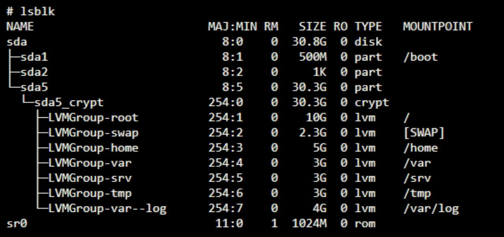

### 2. Install Debian

Let's start the VM and install Debian in it.

Main parts:
- Start installation
- Configure the network
- Configure root and one user
- Configure the partitions (no bonus)
- Configure the partitions (bonus)
- Configure the package manager
- Install boot loader


Start the machine with the Start button.
> - You can make the display bigger by clicking the `blue display at the bottom` > `Virtual screen` > `Scale to 200%`
> - Use the `cmd` key so the machine captures your mouse and vice versa.
> - Use arrows keys and `enter` to navigate during the installation (sometimes you can use the space to select/deselect and tab to move) experienced
#### 🟩 Start installation
> 🌳 
> 
> *Debian* is a free and open-source OS. It is a Linux distribution based on the Unix operating system.
> It is known for its stability, security, and wide range of software packages.
> Debian is developed by a large community of volunteers and is available in over 100 languages.
> Many popular Linux distributions, such as Ubuntu, are based on Debian.
> These distributions inherit Debian's package management system and other features while adding their own unique characteristics.

- Select **Install**, no graphic interface.
- Select *language*, english or the one you want.
- Select *country*, select `Other` if you cannot see yours.
	- If `Other` is selected, Select *continent* and then you will find your country.
	- If the combination of language and country selected is not defined, just choose one country from the shown list to use their settings and your selected country together.
- Configure the keyboard. Select a *keymap* to configure the keyboard.
	- ANSI standard -> American English
#### 🟩 Configure the network
- Configure the network. Set a **hostname** for the VM: `{42login}42`. And leave the **domain** empty.
> 🌳 
> 
> *Configuring the network...*
> - The hostname is a unique name assigned to a particular machine on the network to identify it and distinguish it from other devices. Easier to remember than IP addresses. Useful to communicate with other devices within the network.
> - A FQDN (fully qualified domain name) is a hostname with its domain included (`myname.mydomain.com`). They are used for more formal network addressing, often employed in server environments. We are not going to use a domain in this project.
> 

#### 🟩 Configure users and passwords
- Configure users and passwords. We'll set up the root and a new user.
> - Save all passwords as they will be needed later.
> - To see the password you have typed before confirming, go to `Show Pawssword in Clear` and press the space bar.
- First set a password for the **root account**, we will need to re-enter it to confirm.
- Then a **user account** will be created for us to use instead of the root account for non-administrative activities. We'll be asked for the user *full name* and a *username*: type your login for both. Lastly, choose a password for the new user.
> 🌳 
> 
> *User accounts...*
> - In a Unix-like operating system such as Debian, a "user account" refers to an account created for an individual user. Each person or system process that interacts with the system has its own user account.
> - A user account is associated with a unique username and a user ID (UID). It also has a `/home` directory where the user's files and settings are stored.
> - Users have their own permissions and access rights to files and directories on the system.
> - Normally, the full name would be something like `John Smith` and the username like `jsmith`.
>
> *Root account...*
> - The "root account" or "superuser" or "administrator" is a special user account with the highest privileges, often reserved for system administration tasks.
> - root file system: `/`.
> 

- Configure the clock. Select your *time zone*.


#### 🟩 Configure the partitions
- Configure the **partition disks**. Two options here.
	- `Guided - use entire disk and set up encrypted LVM` as we want encrypted partitions, or
	- `Manual` if we want to do the ✨bonus✨ (➡️ go to [Configure the partitions BONUS](https://github.com/Aryalexa/42-b2bRoot/blob/main/2-Install_Debian.md#-configure-the-partitions-bonus))
> 🌳 
> 
> *Setting up encrypted LVM...*
> - We are going to configure an encrypted Logical Volume Manager during the partitioning process.
> - LVM is a system that manages logical volumes or partitions on a Linux system, it provides a layer of abstraction between the physical storage devices and the file systems, allowing you to create, resize and move logical volumes dynamically.
> - In this case, we are opting to encrypt the data stored on the logical volumes and you will be prompted to provide a passphrase or encryption key. This passphrase will be required to unlock the encrypted volumes each time the system boots.
> - Once the encrypted LVM is set up, you can proceed with creating logical volumes, assigning file systems, and completing the partitioning process.
> 

- Select the only disk we have to set up its partitions.
- Now we have to choose a partitioning scheme, we choose `Separate /home partition`.

> 🌳 
> 
> *Partitioning schemes...*
> 
> We are offered two strategies for organizing the file system partitions
> - All Files in One Partition - your primary partition will hold the entire operating system, including the root file system (`/`) and  the home directory (`/home`). Convenient for for users who don't need to separate their data from the operating system.
> - Separate /home partition - user data is separated from the system files. Two partitions: the root file system (`/`) and the `/home` directory are placed on separate partitions. The root partition contains the OS's core files, system files, binaries, and configuration files, while the /home partition stores user home directories.
> 
> *File system*
> 
> A file system is a way of organizing and storing files. It provides a structure for organizing data, managing access to files, and maintaining metadata (information about the files, such as permissions and timestamps). The file system dictates how files are named, stored, and organized on the storage medium. 
>
> *Root file system*
> 
> The foot file system (`/`) is the base directory of the Linux file hierarchy. It contains essential system files, configuration files, binaries, and directories. All other directories stem from the root directory. The root file system is mounted at the beginning of the boot process, and all other file systems are attached as subdirectories or mount points under the root.
>
> *Home directory*
> 
> The home directory (`/home` or `~` or `/home/username`) is a user-specific directory where a user's personal files, settings, and configurations are stored. Each user has their own home directory. The home directory provides a dedicated space for the users files and allows them to customize their environment.
> 

- The partitioning scheme has to be written to disk before we can configure the LVM. We confirm and the erasing of the data starts. The erasing can be cancel if you want, as it is done to ensure any previous data on the partition is not recoverable.
- Now the *encryption* begins, and we need to choose a passphrase to encrypt the partition. Remember to save this passphrase.
- The next step is setting an amount of _volume group_ to use for the partitioning, we are informed of the maximum size available and minimum size to use. We use the max.
> 🌳 
> 
> A volume group (VG) is a collection of physical volumes (PVs) that can be used to create logical volumes (LVs).
>
> PVs are the basic units of storage space in LVM and they represent physical disks or partitions on a disk.
> 

- Now we see the overview and select `Finish partitioning and write changes to disk`.
```
LVM VG hostname1-vg, LV home - 4.0 GB Linux device-mapper (linear) 
	#1 4.0 GB f ext4 /home
LVM VG hostname1-vg, LV root - 3.0 GB Linux device-mapper (linear)
	#1 3.0 GB f ext4 /
LVM VG hostname1-vg, LV swap_1 - 1.0 GB Linux device-mapper (linear)
	#1 1.0 GB f swap swap
encrypted volume (sda5_crypt) - 8.1 GB Linux device-mapper (crypt)
	#1 8.1 GB K lvm
SCDI2 (0,0,0) (sda) - 8.6 GB ATA VBOX HARDDISK
	#1 primary 510.7 MB F ext2 /boot
	#5 logical 8.1 GB K crypto (sda5_crypt)
```
> 🌳 
> 
> *Understanding the Partition disks overview...*
> - The setup is using LVM to manage logical volumes within the `hostname1-vg` Volume Group.
> - The system has 3 logical volumes (`root`, `home`, `swap_1`): a LV for the root (`/`), one for home (`/home`) directories, and a LV for swap space, which is a temporary storage area for data when physical RAM is full.
> - The first line indicates a LV named `home` within a VG called `hostname1-vg`, the LV size is 4 GB. It uses the ext4 file system. The mount point for the LV is `/home`.
> - These LVs are contained within the encrypted volume named `sda5_crypt`
> - The encrypted volume resides on the physical hard drive (`sda`) and it is used by the LVM.
> - Lastly, the last line describes the physical hard drive (`sda`), which has a total capacity of 8.6 GB. 
> 	- It has one primary partition (#1) of 510.7 MB, formatted as ext4 and mounted at the `/boot` directory, which contains boot loader files.
> 	- The remaining 8.1 GB of space is used for the encrypted LV `sda5_crypt`, which is described in the previous entry.
> 
> ```
> hard disk sda
> |- standard partition /boot
> |- encrypted partition sda5_crypt
> 	|- root LV
> 	|- home LV
> 	|- swap LV
> ```
> 


- After the overview we have to confirm the formats for the three LVs: ext4 for home and root and swap for swap_1.
> 🌳 
> 
> ext4 (Fourth Extended Filesystem) is a widely used and matured file system for Linux-based OSs. It's the fourth int he ext file system family. It provides a good balance of performance, reliability, and backward compatibility with earlier ext file system versions.
> 

#### 🟩 Configure the partitions BONUS
The first part of the bonus consists in having customized partitions as in the image bellow.



SDA is the way Linux marks the partitions/drives/storage devices it senses. For example, the way in windows 10 there is C:,D:,F: e.t.c.
Here we see three partitions, the first one is "boot" and the last one is encrypted with 7 logical volumes in the "LVMGroup" group.

Let's understand as we proceed...
- Select `Manual` for customized partitions.
- Select the only disk we have to set up its partitions (sda - the only device)
- Confirm we want to create a new empty partition table on the selected device.
- Now we see the overview of the current partitions that let us manage the partitions.
   - There's a `free space` to create partitions under the device, ee will use it to create new partitions.

We will crete 2 partitions:
- Let's create the /boot partition (unencrypted) that will be primary and of size 500 MB:
    - `pri/log xxGB FREE SPACE` >> `Create a new partition` >> `500 MB` >> `Primary` >> `Beginning` >> Select `Mount point` to modify it >> `/boot` >> `Done`.
- Let's create a partition for the encrypted logical volumes, it will logical and will use the rest of the available space:
    - `pri/log xxGB FREE SPACE` >> `Create a new partition` >> `max` >> `Logical` >>  `Mount point` >> Select `Do not mount it` >> `Done`.

> 🌳
>
> *Creating partitions...*
> First we a size has to be asign for the partition, we use 500MB for the "boot" partition and the rest for the encrypted one.
>
> Partition types
> - **Primary**. This partition can contain an operating system and its related files. It can no longer be partitioned. If you want to install an OS on a drive, you typically create a primary partition for that purpose. A hard drive can have up to four primary partitions. 
> - **Extended**. It is a special type of primary partition that can be subdivided into logical partitions. You can have only one extended partition on a hard drive. They are used when you need more than four partitions on a drive.
> - **Logical**. Logical partitions are subdivisions within an extended partition. You can create a multiple number of them. They are used to organize and allocate space for additional data or file storage.
>
> When choosing "logical" we are setting an extended partition to be divided into logical partitions.
>
> For the primary disk, we create it at the _beginning_ of the available space as we just want this partition for "boot" purposes. Beginning is the default value if we don't want to do anything spacial later with the partition.
>
> Mount point
>
> A mount point is a directory or location in the file system where the partition is attached or "mounted". As each partition serves a specific purpose, assigning a mount point determines where the contents of that partition will be accessible in the file system. Common mount points: root `/`, `/home`, swap, `/boot`.
> - root: it contains the core system files, and it is the base of the entire file system.
> - `/home`: where user-specific data is stored. It allows user data to be isolated from the system files, making it easier to manage backups or upgrades.
> - swap: this space is used as virtual memory when the physical RAM is fully utilized. It is not assigned a mount point like regular partitions.
> - `/boot`: it contains files necessary for the system to boot.
>
> So, the mount points for these two first partitions are `/boot` and none (because we are going to continue dividing it).

Now that we have two partitions, let's configure the **encrypted** volumes on the second.
- Select `Configure encrypted volumes` and confirm.
- Select `Create encrypted volumes` and the select the disk we want to encrypt (do not encrypt the boot partition)
- `Done` >> `Finish` >> `Yes` to confirm the erase. The encryption starts and it will take some time.
- You will be prompted to provide a passphrase or encryption key. This passphrase will be required to unlock the encrypted volumes each time the system boots.

We are going to configure the encrypted **Logical Volume Manager**.
- Select `Configure the Logical Volume Manager` and confirm.

> 🌳
> LVM (Logical Volumes Manager)
> LVM is a system that manages logical volumes or partitions on a Linux system, it provides a layer of abstraction between the physical storage devices and the file systems, allowing you to create, resize and move logical volumes dynamically.

- We start the configuration selecting `Create volume group`, and name the new volume group `LVMGroup` and select the encrypted partition for the group to be in.
- Now let's create all the Logical Volumes we need (If my encrypted volume is of size 12G, i'm going to change these sizes to fit):
	- `Create Logical Volume` >> `LVMGroup` >> `root` >> (`10G` or `4G`)
	- `Create Logical Volume` >> `LVMGroup` >> `swap` >> `2.3G` or `1G`
	- `Create Logical Volume` >> `LVMGroup` >> `home` >> `5G` or `2G`
	- `Create Logical Volume` >> `LVMGroup` >> `var` >> `3G` or `1G`
	- `Create Logical Volume` >> `LVMGroup` >> `srv` >> `3G` or `1G`
	- `Create Logical Volume` >> `LVMGroup` >> `tmp` >> `3G` or `1G`
	- `Create Logical Volume` >> `LVMGroup` >> `var-log` >> `4G` or `2G`
 	- `Finish` (you can use `Display configuration details` to check before finishing)
 - For each LV we have specified the LG it belongs to, its name and its size.

> 🌳 
> 
> A volume group (VG) is a collection of physical volumes (PVs) that can be used to create logical volumes (LVs).
>
> PVs are the basic units of storage space in LVM and they represent physical disks or partitions on a disk.
>

Now we see the overview and we need to configure each LV with its file system and its mount point.
- For LV home: `#1` >> `Use as` >> `Ext4` >> `Mount point` >> `/home` >> `Done`
- For LV root: `#1` >> `Use as` >> `Ext4` >> `Mount point` >> `/` >> `Done`
- For LV srv: `#1` >> `Use as` >> `Ext4` >> `Mount point` >> `/srv` >> `Done`
- For LV swap: `#1` >> `Use as` >> `swap area` >> `Done`
- For LV tmp: `#1` >> `Use as` >> `Ext4` >> `Mount point` >> `/tmp` >> `Done`
- For LV var: `#1` >> `Use as` >> `Ext4` >> `Mount point` >> `/var` >> `Done`
- For LV var-log: `#1` >> `Use as` >> `Ext4` >> `Mount point` >> `Enter manually` >> `/var/log` >> `Done`


Once the seven LVs are configured, select `Finish partitioning and write changes to disk` and confirm. And wait.

> 🌳 
> 
> ext4 (Fourth Extended Filesystem) is a widely used and matured file system for Linux-based OSs. It's the fourth int he ext file system family. It provides a good balance of performance, reliability, and backward compatibility with earlier ext file system versions.


#### 🟩 Configure the package manager
- Configure the **package manager (apt)**. Now we are asked if we want to add more media, apart from the Debian we have downloaded and used, to be used by the package manager. We say no.
- Now the package manager needs to find a mirror. The mirror is use to keep the Debian system updated, secure, and to install additional software. We select our *country*, and then the archive *mirror* `deb.debian.org`.
- As the system is going to connect to the mirror, the installer ask us if we need an *HTTP proxy*, let's just leave this blank and continue. And wait.
- Do we want to participate in Debian *stats*? No, this is just a one time project.
- Now we are asked which *additional software* we want the package manager to install. We need none, so deselect everything and continue. And wait.

#### 🟩 Install Boot loader
- Right after, the installer recommend us to install *GRUB boot loader* as we are installing an OS, and to install it on the primary partition (`/boot`). We say yes and proceed to install it in the bootable device we were recommended: `/dev/sda`. Aaand wait.
> 🌳 
> 
> The GRUB (Grand Unified Bootloader) is a boot loader from the GNU project. It provides a menu from which you can select the operating system to boot if you have multiple operating systems installed on your computer.
> 

The Debian installation is complete! Let's reboot it!
