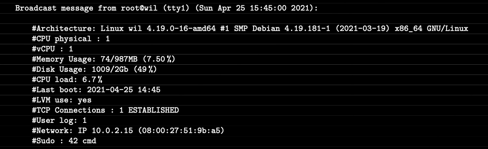

### 5. Script
Let's create the bash script called `monitoring.sh`.

script = sequence of commands in a file to be executed in sequencial order
#### Table of Contents
1. Create the file
2. How to extract info from other commands: `grep` and `awk`
3. Content
4. Make it work every 10 mins in all terminals
5. The script

#### 🟦 1. Create the file

> Where to save the script?
> - If the scripts are used by multiple users or if they are system-wide scripts, you might consider placing them in a directory such as `/usr/local/bin` or `/opt/scripts`.
> - If a user owns the `cron` job, storing the scripts in the home directory of the user is a common practice. For example, `/home/user1` or `/home/user1/scripts`
>
> Ensure that the directories you choose are included in the `PATH` environment variable or provide the full path to the script when configuring the `cron` job.

Create the file `monitoring.sh` and give it execution permissions.
```
$ cd /usr/local/bin
$ touch monitoring.sh
$ chmod 755 monitoring.sh
```
> 🌳
> Some Bash scripting basics:
> - bash variables.
> Variable names are case-sensitive.
> Use the equal sign `=` to assign a value to a variable.
> We use `echo` to print.
> ```bash
> name="John"
> age=25
> echo "Name: $name"
> echo "Age: $age"
> ```
> - command substitution.
> Use `$(command)` to capture the output of a command.
> ```bash
> current_date=$(date)
> echo "Current date: $current_date"
> ```
> - conditional statements.
> Use `-eq`, `-lt`, `-ge`, .. to compare if necessary.
> ```bash
> if [ $age -eq 99 ]; then echo "Yes"
> else echo "No"
> fi
> ```

#### 🟦 2. How to extract info from other commands: `grep` and `awk`


`grep` -> select line

```bash
grep [options] pattern [file(s)]
cat file | grep [options] pattern
```
- Its name stands for "Global Regular Expression Print"
- It is a command-line utility, used for searching and matching patterns within text files.
- The pattern can be a regular expression or plain text.
- By default, it returns all lines from a file (or input) that match the specified pattern.
- `grep "example" myfile.txt` prints all lines in myfile.txt that contain the word "example".

`awk` -> select columns in line

```bash
awk 'pattern { action }' input_file
cat input_file | awk 'pattern { action }'
```
- It is a text processing tool, designed for pattern scanning and processing.
- It processes the input line by line, performing the action to each line that matches the pattern given.
- `awk '{print $1, $3}' filename` prints the first and third columns of each line in the given file.
- It supports formatting too: `{printf("%.2f"), $1}`, `{printf("%.1"), $2}`, `{printf("%.1f%%"), $2}`, `{print $3 " " $4}`, ...
- And much more.

Using both you can filter specific words:
- `wc *.c | grep total | awk '{print $1}'` prints the number of lines for all .c files in the current directory.

#### 🟦 3. Content
We want our script to show something lke this:



The idea is gathering all the information in variables and then printing them in the order that is expected.
For the printing we'll use `wall`, it not only prints, it broadcasts.
> 🌳
> `wall` command
> - It is used to send a message to all users who are currently logged in. A broadcast!
> - The word "wall" stands for "write all."
> ```shell
> $ wall "Attention to all users"
> $ echo "This is a broadcast message" | wall
> $ script_with_echo | wall
> ```
Something like this:
```bash
#!/bin/bash

INFO1=$(command_for_arch)
INFO2=$(command_for_arch)
wall "
      Info1    : $INFO1
      Info2    : $INFO2"
```

So let's gather all the information to show:

##### 🔸 1. Your OS architecture and its kernel version
The command `uname -a` gives us:
- System Name: The name of the operating system.
- Node Name: The network node (hostname) of the machine on the network.
- Kernel Release: The release level of the operating system kernel.
- Kernel Version: The version of the operating system kernel.
- Machine Hardware: The hardware type of the machine.

##### 🔸 2. Number of physical cores
##### 🔸 3. Number of virtual cores
For physical and virtual cores we can use the file `/proc/cpuinfo`. See the lines with "physical id" and "processor".
##### 🔸 4. Current RAM memory available in your server and its usage as a percentage
Use `free` to show RAM data. See options `--mega`, `-h`, `-k`. 
##### 🔸 5. Current memory available in your server and its usage as a percentage (disk)
Use `df` to show disk data. See options `--total`, `-h`, `-k`. 
##### 🔸 6. Current percentage of core/cpu load
```
CPU_LOAD=$(top -bn1 | grep '^%Cpu' | xargs | awk '{printf("%.1f%%"), $2 + $4}')
```
or
```
cpul=$(vmstat 1 2 | tail -1 | awk '{printf $15}')
cpu_op=$(expr 100 - $cpul)
cpu_fin=$(printf "%.1f" $cpu_op)
```
or
```
top -bn1 | grep '^%Cpu' | awk '{printf("%.1f%%"), $2}'
```
##### 🔸 7. Date and time of last system boot
See `who -b`.
##### 🔸 8. Whether LVM is active or not
We want to print "yes" or "no" based on the LVM status.
See `lsblk`.
##### 🔸 9. Number of active connections
Let's count TCP connections.
See `ss -ta` or the file `/proc/net/sockstat`
##### 🔸 10. Number of users in the server
See `users` or `who`
##### 🔸 11. IPv4 address and MAC (Media Access Control) of your server
For IP address: see `hostname -I`.

For MAC address: see `ip link `.
##### 🔸 12. Number of commands executed as sudo
Remember the log? what was the name of the file?
`SUDO_LOG=$(grep COMMAND /var/log/sudo/sudo.log | wc -l)`

#### 🟦 4. Make it work every 10 mins in all terminals
1. All terminals
The `wall` command allows us to broadcast a message to all users in all terminals. This can be incorporated into the `monitoring.sh` script or added later in `cron`.
(If wall is not in the script we can use `bash /root/monitoring.sh | wall` as the command to schedule with `cron`.)

2. Schedule
> 🌳
>
> `cron`
> - It is a time-based job scheduler in Unix-like operating systems.
> - It allows users to schedule tasks (commands or scripts) to run automatically at specified intervals or specific times.
> - These scheduled tasks are often referred to as "cron jobs."
> - The scheduling is stored in a configuration file called the "crontab" (cron table).
> - Each user on a Unix system can have their own crontab file, and system-wide cron jobs may also be defined.
> - A `cron` job is defined by a line in the crontab file (when, who, what)
> - A job line is like `minute hour day month day_of_week usr command_or_/path/to/script_to_execute`, where the user can be ommited and the owner of the crontab is the default user.

To schedule the execution of the script every 10 minutes:
- Edit the the crontab file with `sudo crontab -u root -e` (the root's crontab) and add the rule.
- Add at this end of the file: `*/10 * * * * /usr/local/bin/monitoring.sh` (`*/10` for "every" 10 minutes)

(enable cron?? `# systemctl enable cron`)

(to make it running after reboot add `@reboot /path/to/monitoring.sh` too ??)

