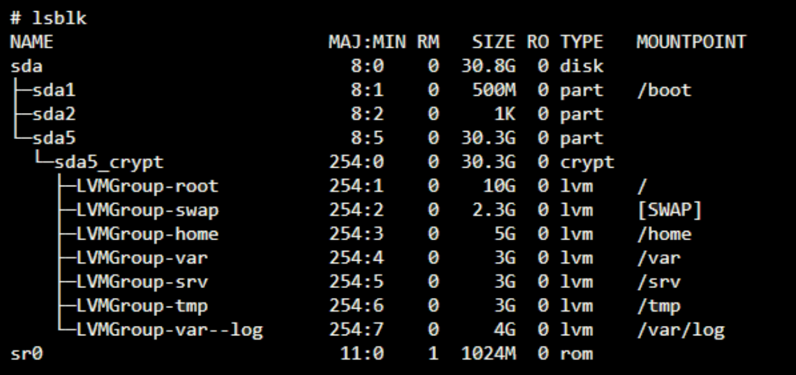

# b2bR Subject

## **Requirements**  

Create a VM with the following requirements.
- Virtualization software: VirtualBox (or UTM)
- OS: last stable version of *Debian*  
- Partitions: at least 2 *encrypted partitions* created with LVM  (see bonus.1, for bonus partitions configuration)
- Main service: The *SSH* service. It should run only on port `4242`. For security reasons, it should not be possible to connect via SSH as root.  
- Configure your OS with the *firewall* UFW, leaving only port `4242` open. (The FW should be active when executing the VM)  
- `hostname` of your VM: `{42login}42`.  
- Use a strong *password policy*  
	- passwords expire after 30 days  
	- the minimum number of days allowed before changing the password is 2  
	- the user is notified with a message 7 days before the password expires  
	- passwords..  
		- consists of minimum 10 characters,  
		- must contain a capital letter and a number.  
		- cannot have the same character consecutively repeated more than 3 times.  
		- cannot contain the user name.  
		- must contain at least 7 new characters not included in the old password (this rule does not apply for the root password)  
- Install and configure `sudo` following strict rules  
- *Users*: `root` and a user with your login must exist  
- Your user must be part of the *groups* `user42` and `sudo`.  

In order to configure a strong password for the group `sudo`:  
- Authenticate yourself as `sudo`, 3 tries at most  
- when using `sudo` and password is wrong, a message must be shown  
- for every command executed with `sudo`, the input and the output must be archived in the directory `/var/log/sudo/`.  
- `TTY` mode must be active for security reasons.  
- For security reasons, usable directories by `sudo` should be restricted. Example:  
	- `/usr/local/sbin:/usr/local/bin:/usr/sbin:/usr/bin:/sbin:/bin:/snap/bin`  

> (!)⚠️☢️ - After tuning your *config files*, all passwords for all current accounts in the VM should be change, root included. > so all passwords comply with the new configurations.

### BASH SCRIPT `monitoring.sh`  
When the server starts, the script should show some information every 10 minutes in all terminals (see `wall`). The wall banner is optional. No errors should be seen.  
The script may be interrupted during evaluation (see `cron`).  
Information to show:  
- Your OS architecture and its kernel version  
- Number of physical cores  
- Number of virtual cores  
- Current RAM memory available in your server and its usage as a percentage  
- Current memory available in your server and its usage as a percentage (disk)  
- Current percentage of core/cpu load  
- Date and time of last reboot  
- Whether LVM is active or not  
- Number of active connections  
- Number of users in the server  
- IPv4 address and MAC (Media Access Control) of your server  
- Number of commands executed as `sudo`  

### BONUS ✨
1. Configure partitions as..

2. Configure a functional WordPress site with the following services: lighttpd, MariaDB, and PHP.
3. Configure a service of your choice that you consider useful (NGINX / Apache2 excluded). Justify your choice.
  
  
## **Evaluation**  
☢️ At the start of every evaluation, the `signature.txt` file and the .vdi file will be compare to check if the state of your VM is the same as at the time of submitting.
-> 2 options: create a snapshot and roll back each time or just clone the hole thing VM 3 times.

⚠️ During evaluation
- What are VMs? What are they used for? how do they work?
- Change the hostname of the VM
- Passwords should comply with the password policies.
- Create a new user to use with SSH  
- Create a new user and assign them to a group  
- Answer questions about the OS selected (Debian vs Rocky), and basic understanding of all tools used (aptitude vs apt, SELinux, AppArmor)
- The script may be interrupted (see `cron`)
  

  
